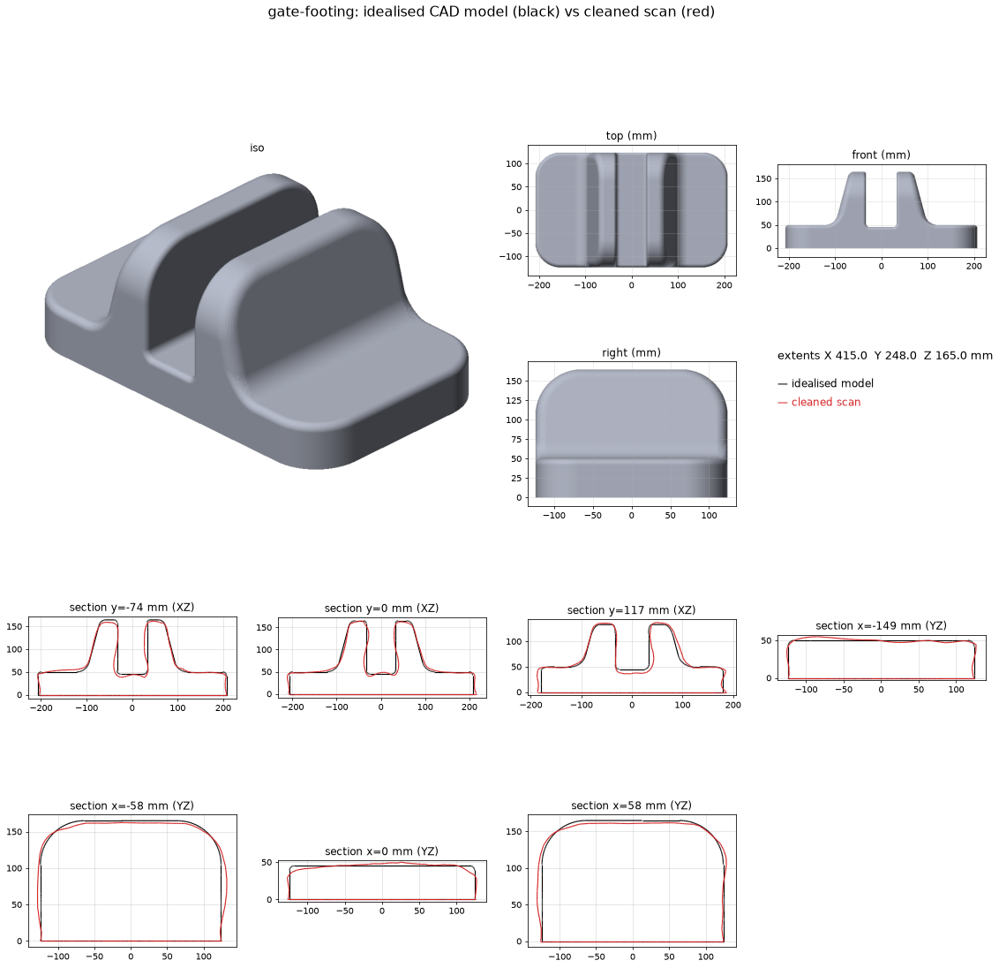

# Gate footing

A plastic foot that holds up a metal gate. It's a rectangular base slab with
two raised uprights running front to back, and a slot between them where the gate sits.

## Goal

A clean, smooth, accurate, printable model of the footing. The real part has smooth
sides and edges, and the scan is wavy, so the deliverable is an **idealised
parametric CAD model** fitted to the scan, not a smoothed scan.
*(Owner to confirm the end use: print a replacement? exact replica or improved?)*

## Status

- [x] Polycam scan imported (`source/polycam-2026-09-24.glb`)
- [x] Scan cleaned: floor removed, levelled, squared up, flat base, watertight
- [x] **Idealised CAD model** (`idealized.py`, build123d): flat faces, flat parallel
      slot walls, straight drafts, true fillets, mirror-symmetric. Exported as
      STEP (Fusion) and STL (Bambu Studio). Mean deviation from the scan is 2.5 mm, mostly
      where the scan is wavy.
- [ ] **Fix the scale.** Everything is still at *scan scale* (415 mm long), which the
      owner says is far too big. When measurements arrive, set
      `MEASURED_LENGTH_X_MM` (and any `MEASURED_OVERRIDES`) in `build.py` and rebuild.
- [ ] Check the slot width, which is the fit-critical dimension, against the gate
- [ ] Underside: solid, hollow, or ribbed? (not captured)
- [ ] Choose the material and orientation, then test print (scale down first to check the fit?)

## Measurements

**Real (tape/calipers):** *none yet. Owner is measuring.*

Model parameters at scan scale (`FootingParams` in `idealized.py`). Real = scan × k,
where k = real length / 415.

| Parameter | Scan scale (mm) | Ratio to length | Real (mm) |
|---|---|---|---|
| `length`: end wall to end wall (X) | 415 | 1.000 | ? |
| `width`: along the slot (Y) | 248 | 0.598 | ? |
| `height`: top of the uprights | 165 | 0.398 | ? |
| `base_h`: base slab thickness | 50 | 0.120 | ? |
| `slot_w`: gap between the uprights | 66 | 0.159 | ? |
| `slot_floor`: slot floor height | 45 | 0.108 | ? |
| `upright_outer_x`: outer face at base top, from centre | 100 | 0.241 | |
| `upright_draft_deg`: outer face lean | 15° | n/a | |
| `footprint_corner_r` | 55 | | |
| `upright_fillet_r` (upright to base) | 28 | | |
| `upright_end_r` (top corners at the Y ends) | 60 | | |
| `upright_top_outer_r` / `upright_top_inner_r` | 15 / 6 | | |
| `base_edge_r` / `slot_floor_r` | 8 / 8 | | |

Most useful to measure: **overall length, width, height, slot width, base thickness.**

## Modelling decisions (idealised model)

- **The slot walls are flat, parallel, and vertical** (as the owner described). The scan's
  slot interior is its noisiest area (the camera can't see into it), and it read as 60–75 mm
  wide depending on height. 66 mm is the average. Use a measured value.
- The upright *outer* faces have a 15° draft. That's consistent across the scan
  (x = 92 → 76 mm over z = 80 → 140).
- The part is mirror-symmetric about the slot centre. The scan's slot centre was 2.5 mm off,
  and the cleaned scan is shifted to match.
- The upright top edges are flat and rounded. The scan's top is slightly crowned (≤3 mm),
  which is treated as noise.
- Solid underneath. The real underside is unknown. For printing, use infill or
  hollow it later.

## Printing notes (after scaling)

- A1 bed is 256³. At scan scale the part doesn't fit (415 mm). At any real size ≤ ~255 mm
  long, it prints in one piece, base down, with no supports (the drafts and fillets are
  self-supporting, and the upright ends are rounded at 60/415 of length).
- Outdoors under load: **PETG**, 4–5 walls, 20–30 % gyroid infill.

## Pipeline

`python projects/gate-footing/build.py` (about 1.5 min):
1. **Scan cleanup** (`tools/meshkit.py`): merge seam vertices → RANSAC ground plane,
   level to Z=0 (mm, Z-up) → keep the largest piece above 2 mm → crop to a 400 mm radius →
   square the footprint → drop the cut edge to Z=0 and cap → watertight.
2. **Idealised model** (`idealized.py`, build123d/OpenCASCADE): base box → drafted
   upright block → slot cut → fillets. Exported as STEP. Tessellated and repaired to
   STL (`meshkit.cad_to_mesh`).
3. Scale both by the measured length, write `report.json` (checks and scan-to-model
   deviation), and render the PNGs.

## Files

- `source/polycam-2026-09-24.glb`: raw Polycam export (≈2 m of ground around the part)
- `output/gate-footing.step`: **idealised model for Fusion** (editable solid)
- `output/gate-footing.stl`: idealised model for Bambu Studio
- `output/gate-footing-scan-clean.stl`: cleaned but wavy scan, useful as a reference body in Fusion
- `output/report.json`: dimensions, watertight/self-intersection checks, deviation, params
- `renders/idealized.png`: model vs scan, views and cross-sections
- `renders/scan-clean.png`, `renders/raw-scan-context.png`

## Log

- **2026-09-24:** Repo set up. Scan cleaned into a watertight solid. The owner flagged that the size
  is wrong: the scan has no floor left, so the photo-mode scan scale is at fault. Waiting on
  measurements. The owner asked for smooth sides and flat faces, so I built the idealised
  parametric CAD model (build123d), which is symmetric with flat slot walls and real fillets, exported
  as STEP and STL. Watertight, 0 self-intersections.
